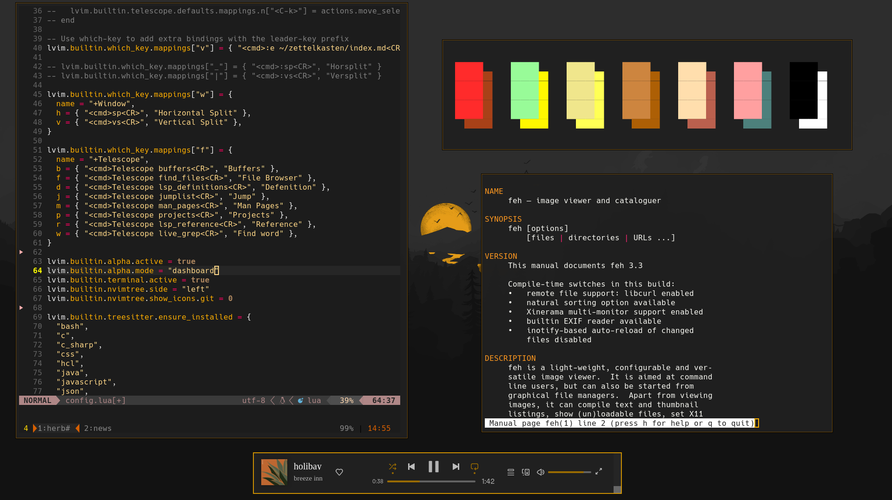
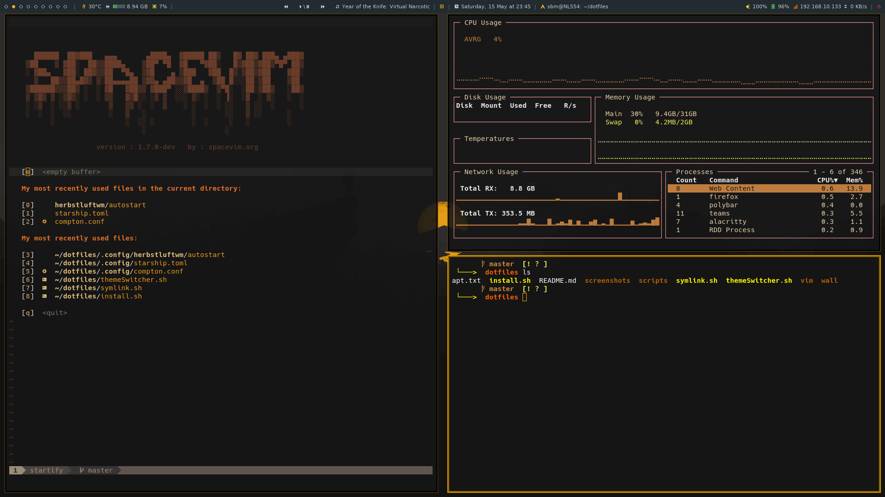
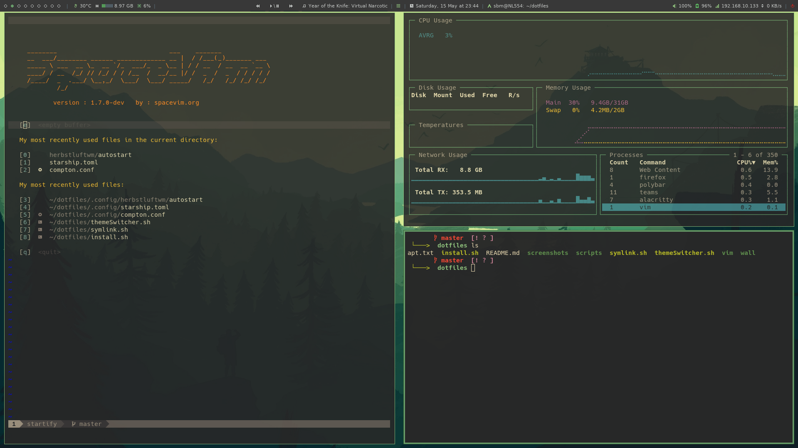

<h2 align="center"> dotfiles </h2>

<div align="center">
   <p></p>
   <a href="">
      
   </a>
   <a href="https://github.com/simonbrgstrm/dotfiles/stargazers">
      
   </a>
   <a href="https://github.com/janleigh/dotfiles/">
      
   </a>
   <br>
</div>

<h2></h2>

## ▶️ <samp>INFORMATION</samp>

   

   Personal configs.


   :small_orange_diamond: **Window Manager:** [herbstluftwm](https://herbstluftwm.org/) :herb:
   
   :small_orange_diamond: **Terminal:** [alacritty](https://github.com/alacritty/alacritty)
   
   :small_orange_diamond: **Sessions:** [tmux](https://github.com/tmux/tmux/wiki)
   
   :small_orange_diamond: **Shell:** [zsh](https://www.zsh.org/)
   
   :small_orange_diamond: **Shell Prompt:** [starship](https://starship.rs/)
   
   :small_orange_diamond: **Panel:** [polybar](https://github.com/polybar/polybar)
   
   :small_orange_diamond: **Compositor:** [compton](https://github.com/chjj/compton)
   
   :small_orange_diamond: **Editor:** [neovim](https://github.com/neovim/neovim)
   
   :small_orange_diamond: **Browser:** [firefox](https://www.mozilla.org/en-US/firefox)
   
   :small_orange_diamond: **Notification Manager:** [dunst](https://github.com/dunst-project/dunst)
   
   :small_orange_diamond: **File Manager:** [ranger](https://github.com/ranger/ranger)
   
   :small_orange_diamond: **Application Launcher:** [rofi](https://github.com/davatorium/rofi)


## Install
1. Clone repo
```
git clone https://github.com/simonbrgstrm/dotfiles.git
```

2. Install all the packages
```
./install.sh
```

3. Install [Polybar](#polybar)

4. Symlink all the configs
```
./symlink.sh
```

### Polybar
```
cd ~/polybar-3.5.5 && ./build.sh
```

Answer `No` on the first two (Clang and i3) and all others `Yes`.

And `Yes` on `sudo make install`

## Screenshots

### sbm


### nord


### gruvbox

