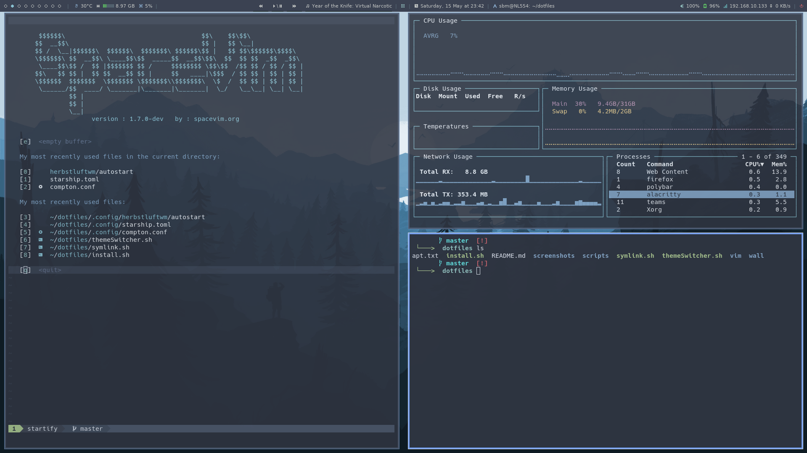

# dotfiles


Personal config files.


## Install
1. Clone repo
```
git clone https://github.com/simonbrgstrm/dotfiles.git
```

2. Install all the packages
```
./install.sh
```

3. Install [Polybar](#polybar)

4. Symlink all the configs
```
./symlink.sh
```

### Polybar
```
cd ~/polybar-3.5.5 && ./build.sh
```

Answer `No` on the first two (Clang and i3) and all others `Yes`.

And `Yes` on `sudo make install`

## Screenshots

### sbm


### nord


### gruvbox

